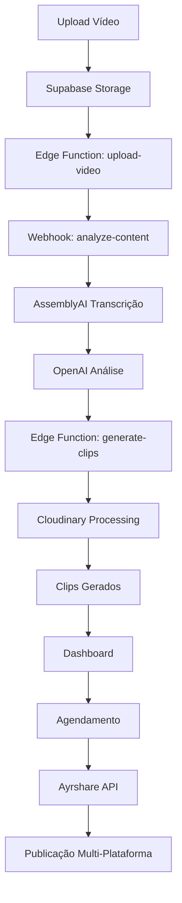

# 🚀 NOVO FLUXO CLIPSFORGE

## 🎯 Visão Geral do Sistema

O **ClipsForge** é uma plataforma revolucionária que transforma vídeos longos em clips virais automaticamente usando inteligência artificial. Este documento descreve o fluxo completo de funcionamento.

## 🔄 Fluxo Principal

### 1. 📤 Upload de Vídeo
- **Interface**: Drag & drop moderna com preview
- **Formatos**: MP4, MOV, AVI, MKV (até 2GB)
- **Validação**: Verificação automática de formato e tamanho
- **Storage**: Upload direto para Supabase Storage

### 2. 🤖 Análise Inteligente
- **Transcrição**: AssemblyAI para texto preciso
- **IA de Conteúdo**: OpenAI analisa momentos virais
- **Identificação**: Hooks, punchlines, momentos emocionais
- **Segmentação**: Divisão em clips de 15-60 segundos

### 3. ✂️ Geração de Clips
- **Processamento**: Cloudinary para cortes precisos
- **Otimização**: Formatos específicos por plataforma
- **Templates**: Estilos visuais automáticos
- **Qualidade**: Manutenção da resolução original

### 4. 📱 Multi-Plataforma
- **TikTok**: 9:16, até 60s, trending hashtags
- **Instagram Reels**: 9:16, até 90s, música popular
- **YouTube Shorts**: 9:16, até 60s, SEO otimizado
- **LinkedIn**: 16:9, até 3min, profissional

### 5. 📅 Agendamento Inteligente
- **Horários Ótimos**: Análise de engajamento
- **Frequência**: 3x por dia automaticamente
- **Distribuição**: Espaçamento inteligente
- **Customização**: Controle manual disponível

## 🏗️ Arquitetura Técnica



## 🛠️ Configuração de Desenvolvimento

### Pré-requisitos
```bash
# Node.js 18+
node --version

# Supabase CLI
npm install -g supabase

# Dependências do projeto
npm install
```

### Setup Local
```bash
# Clone o repositório
git clone https://github.com/clipsforge/clipsforge.git
cd clipsforge

# Configure variáveis de ambiente
cp .env.example .env.local

# Inicie Supabase local
npx supabase start

# Execute o projeto
npm run dev
```

### URLs de Desenvolvimento
- **Frontend**: http://localhost:8080
- **Supabase Studio**: http://127.0.0.1:54323
- **API**: http://127.0.0.1:54321

## 🧪 Testes

### Teste Completo do Sistema
```bash
# Execute o script de teste
./scripts/test-new-flow.sh
```

### Testes Unitários
```bash
# Todos os testes
npm test

# Teste específico
npm test -- useVideoUpload.test.ts

# Com coverage
npm test -- --coverage
```

## 📊 Monitoramento

### Dashboard Analytics
- **Vídeos Processados**: Contador em tempo real
- **Clips Gerados**: Total e por plataforma
- **Engajamento**: Métricas de performance
- **Erros**: Log de problemas e soluções

### Logs do Sistema
```bash
# Logs do Supabase
npx supabase logs

# Logs específicos de função
npx supabase functions logs generate-clips
```

## 🔧 Troubleshooting

### Problemas Comuns

#### 1. Upload Falha
```bash
# Verificar storage policies
npx supabase db reset --local
```

#### 2. Edge Function Timeout
```bash
# Reiniciar functions
npx supabase functions deploy --local
```

#### 3. Frontend Não Carrega
```bash
# Limpar cache e reiniciar
./scripts/restart-dev.sh
```

## 🚀 Deploy em Produção

### Supabase
```bash
# Deploy das functions
npx supabase functions deploy

# Aplicar migrações
npx supabase db push
```

### Frontend (Vercel)
```bash
# Build otimizado
npm run build

# Deploy automático via Git
git push origin main
```

## 📈 Roadmap

### Fase 1 - MVP ✅
- [x] Upload de vídeos
- [x] Análise com IA
- [x] Geração básica de clips
- [x] Dashboard funcional

### Fase 2 - Automação 🔄
- [ ] Agendamento inteligente
- [ ] Multi-plataforma completa
- [ ] Analytics avançados
- [ ] Templates customizáveis

### Fase 3 - Scale 📊
- [ ] API pública
- [ ] Integrações avançadas
- [ ] White-label
- [ ] Mobile app

## 🤝 Contribuição

### Processo de Desenvolvimento
1. Fork do repositório
2. Criar branch feature: `git checkout -b feature/nova-funcionalidade`
3. Commit das mudanças: `git commit -m 'Add nova funcionalidade'`
4. Push para branch: `git push origin feature/nova-funcionalidade`
5. Abrir Pull Request

### Padrões de Código
- **TypeScript** obrigatório
- **ESLint** configurado
- **Prettier** para formatação
- **Testes** para novas features

---

**🎬 ClipsForge - Transformando vídeos em viral desde 2024** 