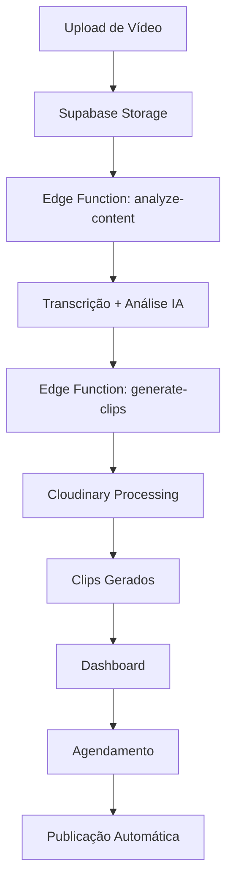

# 📁 Estrutura do Projeto ClipsForge

## 🎯 Visão Geral

O **ClipsForge** é uma plataforma revolucionária que utiliza inteligência artificial para transformar vídeos longos em clips curtos otimizados para redes sociais. Esta documentação descreve a organização completa do projeto.

## 🏗️ Estrutura de Diretórios

```
clipsforge/
├── 📂 src/                     # 💻 Código fonte principal
│   ├── 📂 components/          # ⚛️ Componentes React reutilizáveis
│   │   ├── 📂 auth/           # 🔐 Componentes de autenticação
│   │   ├── 📂 layout/         # 🎨 Componentes de layout
│   │   ├── 📂 upload/         # 📤 Componentes de upload
│   │   └── 📂 ui/             # 🧩 Componentes base (shadcn/ui)
│   ├── 📂 contexts/           # 🔄 React Context providers
│   ├── 📂 hooks/              # 🎣 Custom hooks
│   ├── 📂 integrations/       # 🔗 Integrações externas
│   ├── 📂 lib/                # 🛠️ Utilitários e configurações
│   ├── 📂 pages/              # 📄 Páginas da aplicação
│   └── 📂 types/              # 📝 Definições de tipos TypeScript
├── 📂 supabase/               # 🗄️ Backend e banco de dados
│   ├── 📂 functions/          # ⚡ Edge Functions (IA e processamento)
│   └── 📂 migrations/         # 🔄 Migrações do banco de dados
├── 📂 docs/                   # 📚 Documentação completa
├── 📂 scripts/                # 🔧 Scripts de automação e utilidades
├── 📂 tests/                  # 🧪 Testes automatizados
├── 📂 tools/                  # 🛠️ Ferramentas de desenvolvimento
└── 📂 public/                 # 📁 Arquivos estáticos
```

## 📋 Detalhamento dos Diretórios

### 🎯 `/src` - Código Fonte Principal

#### 📂 `/src/components`
Componentes React organizados por funcionalidade:

- **`/auth`** - Autenticação e controle de acesso
  - `ProtectedRoute.tsx` - Proteção de rotas autenticadas
  
- **`/layout`** - Estrutura e layout da aplicação
  - `AppLayout.tsx` - Layout principal da aplicação
  
- **`/upload`** - Funcionalidades de upload de vídeo
  - `ProcessingConfig.tsx` - Configuração de processamento
  - `ProcessingMonitor.tsx` - Monitoramento em tempo real
  - `ProcessingViewer.tsx` - Visualizador de processamento
  - `RecentVideos.tsx` - Lista de vídeos recentes
  
- **`/ui`** - Componentes de interface base (shadcn/ui)
  - Biblioteca completa de componentes reutilizáveis

#### 📂 `/src/pages`
Páginas principais da aplicação:

- **`Index.tsx`** - 🏠 Página inicial (landing page)
- **`Dashboard.tsx`** - 📊 Dashboard principal
- **`Upload.tsx`** - 📤 Interface de upload
- **`Clips.tsx`** - ✂️ Gerenciamento de clips
- **`Schedule.tsx`** - 📅 Agendamento de posts
- **`/auth`** - Páginas de autenticação

#### 📂 `/src/contexts`
Gerenciamento de estado global:

- **`AuthContext.tsx`** - Contexto de autenticação com auto-refresh

#### 📂 `/src/hooks`
Custom hooks reutilizáveis:

- **`useVideoUpload.ts`** - Hook para upload de vídeos
- **`use-toast.ts`** - Sistema de notificações

### 🗄️ `/supabase` - Backend

#### 📂 `/supabase/functions`
Edge Functions para processamento:

- **`analyze-content/`** - Análise de conteúdo com IA
- **`generate-clips/`** - Geração automática de clips
- **`transcribe-video/`** - Transcrição de vídeos
- **`upload-video/`** - Processamento de upload
- **`schedule-post/`** - Agendamento de publicações

#### 📂 `/supabase/migrations`
Migrações do banco de dados organizadas cronologicamente.

### 📚 `/docs` - Documentação

- **`PROJECT_STRUCTURE.md`** - Este arquivo
- **`NOVO_FLUXO.md`** - Documentação do fluxo principal
- **`TROUBLESHOOTING.md`** - Guia de solução de problemas
- **`ORGANIZATION_SUMMARY.md`** - Resumo da organização

### 🔧 `/scripts` - Automação

- **`test-new-flow.sh`** - Teste completo do sistema
- **`restart-dev.sh`** - Reinicialização do ambiente

### 🧪 `/tests` - Testes

- **`setup.ts`** - Configuração dos testes
- **`*.test.ts`** - Arquivos de teste específicos

## 🚀 Tecnologias Utilizadas

### Frontend
- **React 18** - Biblioteca principal
- **TypeScript** - Tipagem estática
- **Vite** - Build tool e dev server
- **Tailwind CSS** - Framework CSS
- **shadcn/ui** - Componentes de interface
- **Lucide React** - Ícones

### Backend
- **Supabase** - BaaS completo
- **PostgreSQL** - Banco de dados
- **Edge Functions** - Processamento serverless
- **Cloudinary** - Processamento de vídeos

### Ferramentas
- **Vitest** - Framework de testes
- **ESLint** - Linting
- **PostCSS** - Processamento CSS

## 📊 Fluxo de Dados



## 🔧 Configuração de Desenvolvimento

### Variáveis de Ambiente
```env
VITE_SUPABASE_URL=your_supabase_url
VITE_SUPABASE_ANON_KEY=your_supabase_anon_key
CLOUDINARY_CLOUD_NAME=your_cloudinary_name
CLOUDINARY_API_KEY=your_cloudinary_key
CLOUDINARY_API_SECRET=your_cloudinary_secret
```

### Scripts Disponíveis
```bash
npm run dev          # Desenvolvimento
npm run build        # Build para produção
npm run test         # Executar testes
npm run lint         # Verificação de código
```

## 🎯 Próximos Passos

1. **Expansão de Plataformas** - Suporte para mais redes sociais
2. **Templates Avançados** - Mais opções de customização
3. **Analytics Avançados** - Métricas mais detalhadas
4. **API Pública** - Integração com ferramentas externas
5. **Mobile App** - Aplicativo nativo

---

**🎬 ClipsForge - Transformando vídeos em viral desde 2024** 