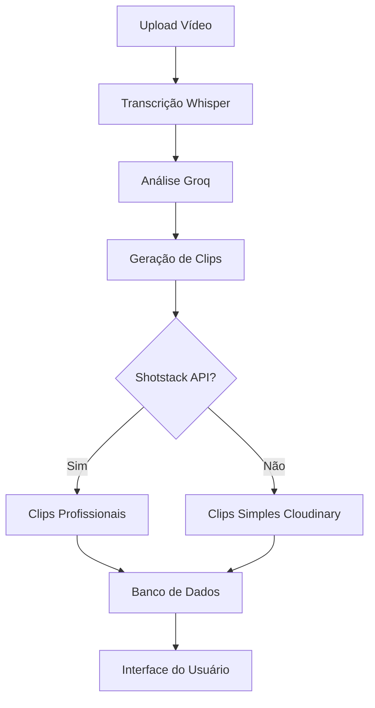
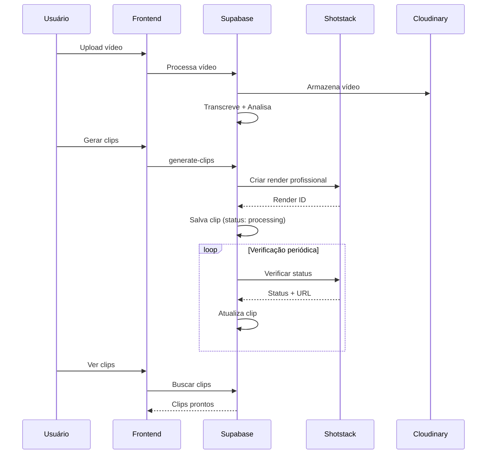

# 🎬 Integração com APIs de Edição de Vídeo Gratuitas

Este guia explica como integrar APIs de edição de vídeo gratuitas no ClipBursts para gerar clips profissionais com legendas, transições e otimização por plataforma.

## 🎯 APIs Recomendadas com Planos Gratuitos

### 1. **SHOTSTACK** ⭐ **MAIS RECOMENDADA**
- **Gratuito**: 10 créditos (1 crédito = 1 minuto de vídeo)
- **Funcionalidades**:
  - Cortes automáticos com precisão
  - Legendas/subtítulos dinâmicos
  - Transições profissionais (fade, slide, etc.)
  - Templates otimizados por plataforma
  - Qualidade 1080p
  - Renderização em nuvem
- **Ideal para**: Clips virais, highlights, montagens
- **Site**: https://shotstack.io
- **Documentação**: https://shotstack.io/docs

### 2. **CREATOMATE**
- **Gratuito**: 50 créditos (1 minuto 720p ≈ 14 créditos)
- **Funcionalidades**:
  - Editor visual intuitivo
  - Templates para TikTok/Instagram/YouTube
  - Bulk generation via planilhas
  - JavaScript SDK para preview
- **Site**: https://creatomate.com

### 3. **BANNERBEAR**
- **Gratuito**: 30 créditos
- **Funcionalidades**:
  - Mais focado em imagens
  - Funcionalidade básica de vídeo
  - Integração com Zapier/Make
- **Site**: https://bannerbear.com

## 🚀 Implementação no ClipBursts

### Arquitetura Atual



### Funções Implementadas

#### 1. `generate-clips` (Melhorada)
- **Localização**: `supabase/functions/generate-clips/index.ts`
- **Funcionalidades**:
  - Integração com Shotstack API
  - Fallback para Cloudinary simples
  - Otimização por plataforma (TikTok 9:16, Instagram 1:1, YouTube 16:9)
  - Legendas baseadas na transcrição
  - Máximo 3 clips para economizar créditos gratuitos

#### 2. `check-shotstack-status` (Nova)
- **Localização**: `supabase/functions/check-shotstack-status/index.ts`
- **Funcionalidades**:
  - Verifica status dos renders em andamento
  - Atualiza URLs quando clips estão prontos
  - Fallback automático em caso de falha

## 🔧 Configuração

### 1. Criar Conta Shotstack (Gratuita)

1. Acesse https://shotstack.io
2. Clique em "Try for free"
3. Crie sua conta
4. Acesse o dashboard
5. Copie sua API Key

### 2. Configurar no Supabase

1. Acesse o painel do Supabase: https://supabase.com/dashboard
2. Vá em **Settings** → **Edge Functions**
3. Adicione a variável de ambiente:
   ```
   SHOTSTACK_API_KEY=sua_api_key_aqui
   ```

### 3. Testar Integração

Execute o script de teste:

```bash
./scripts/test-shotstack-clips.sh
```

## 📊 Exemplo de Uso

### Clip Simples (Cloudinary)
```javascript
// URL simples com corte temporal
const clipUrl = `${videoUrl}/upload/so_30,eo_60/video.mp4`
```

### Clip Profissional (Shotstack)
```javascript
const timeline = {
  tracks: [
    {
      clips: [{
        asset: {
          type: 'video',
          src: videoUrl,
          trim: 30,
          volume: 0.8
        },
        start: 0,
        length: 30,
        fit: 'crop',
        scale: 1.2
      }]
    },
    {
      clips: [{
        asset: {
          type: 'title',
          text: 'Título do Clip',
          style: 'future',
          color: '#ffffff',
          background: 'rgba(0,0,0,0.7)'
        },
        start: 0,
        length: 3,
        transition: { in: 'fade', out: 'fade' }
      }]
    },
    {
      clips: [{
        asset: {
          type: 'title',
          text: 'Legendas automáticas...',
          style: 'subtitle',
          position: 'bottom'
        },
        start: 0,
        length: 30
      }]
    }
  ]
}
```

## 🎨 Recursos dos Clips Profissionais

### Otimização por Plataforma

| Plataforma | Resolução | Aspect Ratio | Características |
|------------|-----------|--------------|-----------------|
| **TikTok** | 1080x1920 | 9:16 | Vertical, legendas grandes |
| **Instagram** | 1080x1080 | 1:1 | Quadrado, foco central |
| **YouTube** | 1920x1080 | 16:9 | Horizontal, qualidade máxima |

### Elementos Visuais

- **Títulos**: Animados com fade in/out
- **Legendas**: Baseadas na transcrição real
- **Transições**: Profissionais (slide, fade, zoom)
- **Background**: Otimizado para cada plataforma
- **Audio**: Fade in/out automático

## 📈 Monitoramento e Status

### Status dos Clips

- **`queued`**: Na fila de renderização
- **`rendering`**: Sendo processado
- **`processing`**: Aguardando conclusão (status local)
- **`ready`**: Pronto para uso
- **`failed`**: Falhou (usa fallback Cloudinary)

### Verificação Automática

Execute periodicamente para atualizar status:

```bash
curl -X POST "${SUPABASE_URL}/functions/v1/check-shotstack-status" \
  -H "Authorization: Bearer ${SUPABASE_ANON_KEY}"
```

## 💰 Gestão de Créditos Gratuitos

### Shotstack (10 créditos gratuitos)
- **1 crédito = 1 minuto de vídeo**
- **Clips de 30s = 0.5 crédito**
- **Total possível**: ~20 clips de 30s
- **Renovação**: Mensal (plano gratuito)

### Estratégias de Economia

1. **Limite de 3 clips por vídeo** (implementado)
2. **Duração máxima de 60s por clip**
3. **Fallback automático** para Cloudinary
4. **Preview antes de renderizar** (futuro)

## 🔄 Fluxo Completo



## 🚨 Troubleshooting

### Problemas Comuns

1. **API Key não configurada**
   - Verifique se `SHOTSTACK_API_KEY` está no Supabase
   - Teste com: `echo $SHOTSTACK_API_KEY`

2. **Clips ficam em "processing"**
   - Execute `check-shotstack-status`
   - Verifique logs no Supabase Dashboard

3. **Créditos esgotados**
   - Sistema usa fallback automático
   - Monitore uso no dashboard Shotstack

4. **Qualidade baixa**
   - Verifique resolução do vídeo original
   - Ajuste configurações de escala

### Logs Úteis

```bash
# Ver logs das funções
supabase functions logs generate-clips
supabase functions logs check-shotstack-status

# Testar localmente
supabase functions serve generate-clips
```

## 🎯 Próximos Passos

### Curto Prazo
- [ ] Configurar Shotstack API Key
- [ ] Testar geração de clips
- [ ] Validar qualidade dos clips
- [ ] Implementar verificação automática

### Médio Prazo
- [ ] Preview antes de renderizar
- [ ] Templates customizáveis
- [ ] Batch processing otimizado
- [ ] Métricas de uso de créditos

### Longo Prazo
- [ ] Editor visual integrado
- [ ] IA para otimização automática
- [ ] Integração com outras APIs
- [ ] Sistema de cache inteligente

## 📞 Suporte

- **Shotstack**: https://shotstack.io/support
- **Documentação**: https://shotstack.io/docs/api
- **Status**: https://status.shotstack.io
- **Comunidade**: Discord/Slack oficial

---

**💡 Dica**: Comece sempre com o plano gratuito para validar a integração antes de considerar upgrades pagos! 